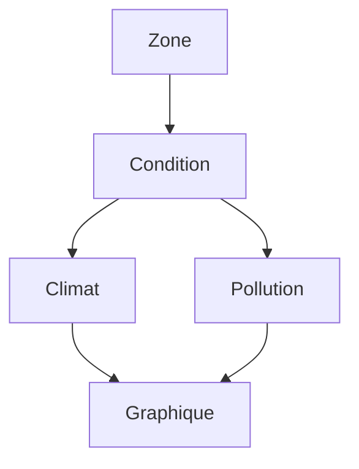
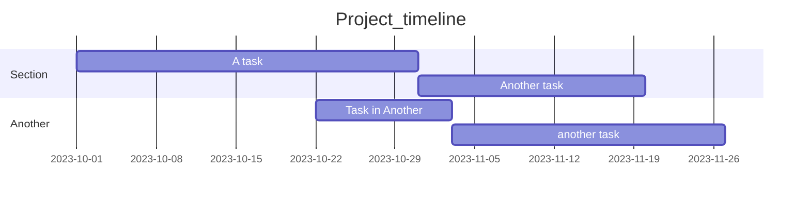

# HAX712X_group5_project
L'objectif du projet est de créer une application web dans laquelle il sera possible de visualiser un graphique ou plusieurs graphiques simultanément décrivant l'évolution d'une valeur de polluant en fonction d'une donnée du climat. Tout ceci pourra être conditionné en amont par d'autres choix.

De plus, nous créerons une carte intéractive cliquablede la région Occitanie à la précision du canton pour obtenir un traitement suffisamment fin, l'échelle du département étant trop grande. 

Pour faire tout ça, nous nous organiserons en trois équipes 
 - équipe 1 : le traitement des données
 - équipe 2 : le visuel
 - équipe 3 : le lien

## Le traitement des données

Les packages standarts de traitements des données seront utilisées ici : pandas, numpy, scipy. Il s'agira dans un premier temps de nettoyer les données pour obtenir des dataframes utilisables.

## Le visuel

Pour créer cette carte, nous utiliserons le package Python : folium. Nous introduirons un fichier Geojson pour obtenir une carte cliquable à la précision du canton.

Pour définir nos choix de variables à utiliser pour tracer les grahiques, nous utiliserons le package python dash. Cela nous permettra d'obtenir d'intéractivité dans nos graphiques.

Pour les graphiques, plusieurs choix s'offrent à nous : matplotlib, seaborn. Nous ne sommes pas encore fixés dessus. 

## Membres et contact

- Abchiche Thiziri : thiziri.abchiche@etu.umontpellier.fr
- Bernard-Reymond Guillaume : guillaume.bernard-reymond@etu.umontpellier.fr
- Hamomi Majda : majda.hamomi@etu.umontpellier.fr
- Gaggini Lorenzo : lorenzo.gaggini@etu.umontpellier.fr
- Ollier Julien : julien.ollier@etu.umontpellier.fr
